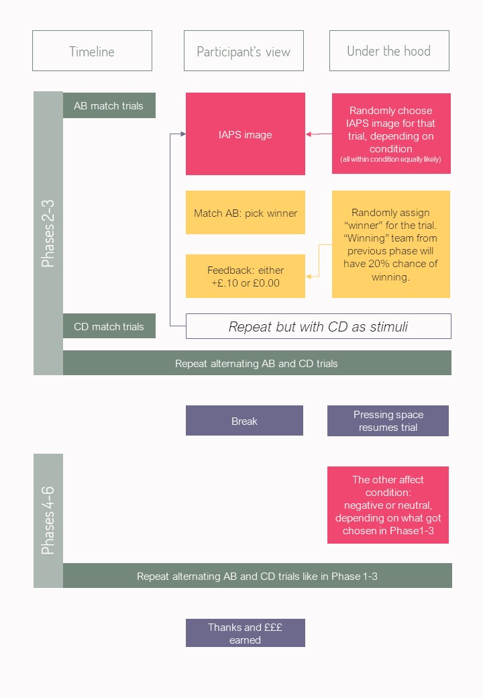

Version 0.1: 

## Recognition
When using this work, or any part of it, please cite it: 
Maris Vainre, Becky Gilbert & Marc Bennet (2021). Affective Probabilistic Reversal Learning Task using jsPsych. Version 0.1. Github repository. https://dx.doi.org/10.5281/zenodo.4446520

## Description 
This is a learning task with an affective condition preceeding the task. The task narrative involves a fictional football league where participants are asked to guess the winner of the match (= 1 trial). The outline looks like this:

