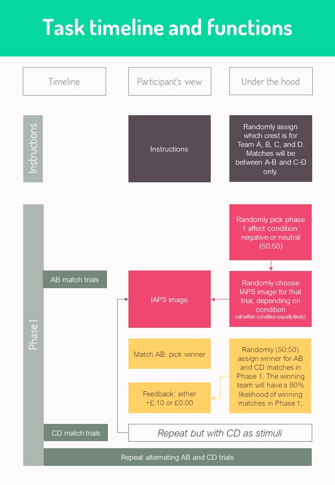
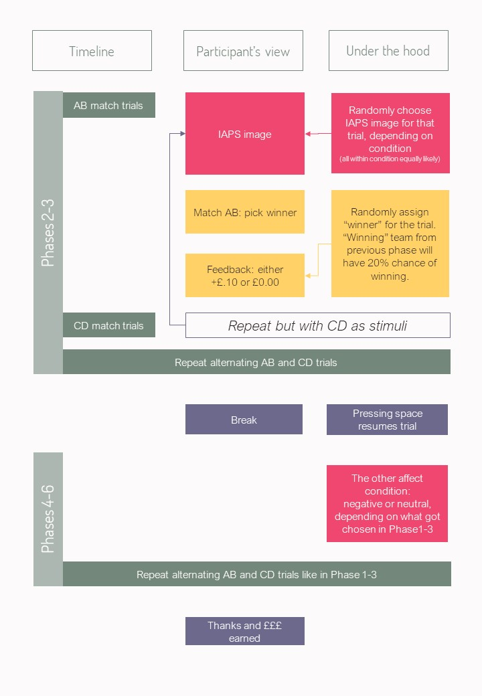

```{r setup, include=FALSE}
knitr::opts_chunk$set(echo = TRUE)
```

## Recognition
When using this work, or any part of it, please cite it:<br>
Maris Vainre, Becky Gilbert & Marc Bennet (2021). Affective Probabilistic Reversal Learning Task using jsPsych. Github repository. https://github.com/mvainre/probabilistic-reversal-learning-task

## Description 
This is a learning task with an affective condition preceeding the task. The task narrative involves a fictional football league where participants are asked to guess the winner of the match (= 1 trial). The outline looks like this:



